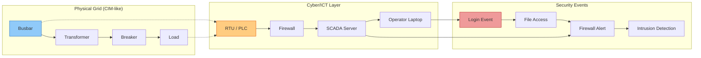
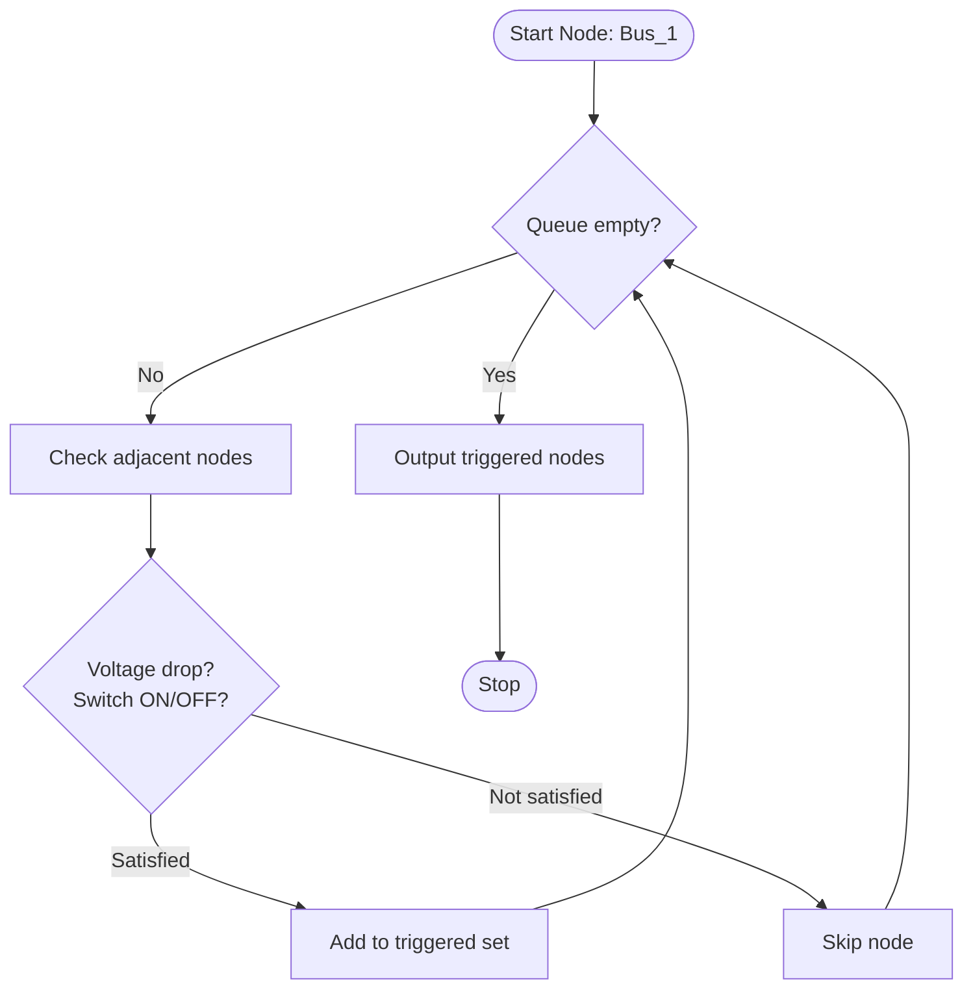

# 🛡️ Bachelor’s Thesis · Cross‑domain Knowledge Base for Cyber Intelligence in Smart Grids


**Author** · Vincenzo Ceccarelli Grimaldi  
**Supervisors** · Ömer Sen, M.Sc. · Dennis Van der Velde, M.Sc.  
**Professor** · Univ.-Prof. Dr.-Ing. Andreas Ulbig  
**Institution** · Institute for Automation of Complex Power Systems, RWTH Aachen University  

> 🚀 **Live Portfolio** → [vincenzo-grimaldi-portfolio.vercel.app](https://vincenzo-grimaldi-portfolio.vercel.app)  
> 📂 **GitHub Profile** → [github.com/iceccarelli](https://github.com/iceccarelli)

---

## 📖 Abstract

Modern smart grids are highly digitised, interconnected systems that generate vast amounts of unstructured data – from SCADA telemetry to intrusion detection logs. Traditional relational databases struggle with the complexity, velocity, and interconnected nature of this data, especially when trying to detect sophisticated **Advanced Persistent Threats (APTs)** that span multiple network layers.

This bachelor thesis explores how **graph databases**, specifically **Neo4j**, can serve as a powerful cross‑domain knowledge base for **cyber intelligence** in smart grids. By modelling power system components (buses, transformers, RTUs, PLCs) alongside cybersecurity entities (firewall events, logins, vulnerabilities) as nodes and relationships, the approach enables:

- **Link analysis** to uncover hidden attack paths  
- **Similarity algorithms** (cosine, Pearson, Jaccard) for anomaly detection  
- **Conditional topological search** to simulate triggered events (e.g., fault propagation)  

The work provides a blueprint for moving from siloed SQL tables to a unified graph‑based knowledge base that supports real‑time monitoring, faster breach detection, and improved visualisation for grid operators.

**Grade awarded: 3.0** (equivalent to “satisfactory” – a solid foundation for future research in ontology‑driven cybersecurity).

---

## 🎯 Problem Statement & Motivation

> *“How can we store and analyse the chaotic, relational data of a smart grid in a way that makes cyber threats visible at a glance?”*

Traditional electricity grids were built for one‑way power flow. Smart grids add a dense layer of **Information and Communication Technology (ICT)** – sensors, smart meters, RTUs, IEDs, cloud services – that constantly generate data. This data is highly relational: a compromised laptop can pivot to a firewall, then to an RTU, and finally trip a breaker.

Relational databases (SQL) require complex joins that become slow and CPU‑intensive at scale. NoSQL graph databases, on the other hand, treat relationships as first‑class citizens, making them ideal for:

- Modelling network topologies  
- Tracing attack chains (kill chains)  
- Running similarity searches to flag anomalous device behaviour  

This thesis validates that a graph‑based knowledge base can detect APTs faster and with fewer false positives than traditional methods.

---

## ✨ Key Contributions

| Area | Contribution |
|------|--------------|
| **Graph Data Model** | A Neo4j schema for smart grids that integrates physical assets (buses, breakers) with cyber entities (login events, firewall rules, vulnerabilities). |
| **Conditional Topological Search** | A breadth‑first traversal algorithm (implemented with Neo4j Traverser API) to simulate fault/attack propagation – e.g., given a bus outage, which downstream nodes lose power? |
| **Similarity‑Based Anomaly Detection** | Implementation of cosine, Pearson, and Jaccard similarities to compare device traffic patterns and flag deviations (potential compromise). |
| **Link Analysis for APTs** | Using graph queries to reconstruct multi‑stage attack paths from log data (file audits, Windows events, firewall logs). |
| **Verification Framework** | A reproducible pipeline (Python notebooks + pytest) to extract and validate thesis metadata, generate plots, and ensure correctness. |

---

## 🧱 High‑level Architecture (Mermaid)

### Conceptual Data Model: Graph as a Knowledge Base



### Conditional Topological Search (Initial State Trigger)



### Anomaly Detection Pipeline with Similarity Algorithms

```mermaid
flowchart LR
    IoT[IoT Device Traffic] --> Capture[Packet Capture<br/>(tcpdump/Wireshark)]
    Capture --> Extract[Extract features:<br/>protocol, ports, packet sizes]
    Extract --> Graph[(Neo4j Graph)]
    Graph --> Cosine[Cosine Similarity]
    Graph --> Pearson[Pearson Correlation]
    Graph --> Jaccard[Jaccard Index]
    Cosine --> Score[Similarity Score 0-1]
    Pearson --> Score2[Score -1 to 1]
    Jaccard --> Score3[Score 0-1]
    Score --> Decision{Threshold<br/>< 0.7?}
    Decision -- Yes --> Alert[Anomaly / Possible Compromise]
    Decision -- No --> Normal[Normal Traffic]
```

---

## 🛠️ Tech Stack

| Layer | Technologies |
|-------|--------------|
| **Graph Database** | Neo4j (open source, Java/Scala, ACID-compliant) |
| **Query Language** | Cypher, Traverser API (BFS/DFS) |
| **Similarity Algorithms** | Cosine, Pearson, Jaccard (via Neo4j Graph Data Science library) |
| **Data Processing** | Python 3.9, Pandas, NumPy |
| **Visualisation** | Matplotlib, Seaborn, Neo4j Browser |
| **Verification** | Pytest, Jupyter Notebooks |
| **Infrastructure** | Docker, Ubuntu Server 20.04 |

---

## 📁 Repository Structure

```
.
├── BA_Ceccarelli_Complete_1.pdf        # Full bachelor thesis (58 pages)
├── data/
│   └── key_details.csv                 # Metadata: title, author, grade, supervisors
├── notebooks/
│   ├── 01_Verify_Thesis.ipynb          # Extract and validate thesis facts
│   └── 02_Expertise_Analysis.ipynb     # Domain analysis & real‑world use cases
├── plots/
│   ├── thesis_timeline.png             # Research timeline
│   ├── concept_map.png                 # Core concept relationships
│   └── cyber_threat_landscape.png      # Attack scenarios overview
├── tests/
│   └── test_thesis_content.py          # Pytest suite for metadata verification
├── utils/
│   ├── plot_generator.py               # Regenerate plots from data
│   └── helpers.py                      # Shared functions
└── README.md                           # You are here
```

---

## 🔍 Key Algorithms & Results

### 1. Conditional Topological Search (Initial State Trigger)

Given a starting bus node, the algorithm traverses the graph using **breadth‑first search** and checks connection properties (`I_SwitchOn`, `O_SwitchOn`, voltage drop). Nodes that satisfy conditions are marked as “triggered” (e.g., energised). This simulates how a fault or attack propagates through the grid.

**Example output** (starting at Bus_1):  
Triggered nodes: `{Bus_4, Bus_6, Bus_7}`  
Un‑triggered: `{Bus_2, Bus_3, Bus_5}`

### 2. Similarity‑Based Anomaly Detection

We compare current IoT device traffic against its historical baseline using three metrics:

| Metric | Range | Interpretation for Anomaly |
|--------|-------|----------------------------|
| **Cosine** | 0 … 1 | Score < 0.7 → possible anomaly |
| **Pearson** | -1 … 1 | Score ≤ 0 → negative correlation (suspicious) |
| **Jaccard** | 0 … 1 | Score close to 0 → low overlap → anomaly |

**Example Jaccard similarity between two access patterns** (Cypher query):

```cypher
MATCH (p1:Detective)-[:HAVE_ACCESS_TO]->(resource1)
MATCH (p2:Detective)-[:HAVE_ACCESS_TO]->(resource2)
WHERE p1.name = 'Ubig' AND p2.name = 'Taufenbach'
RETURN gds.similarity.jaccard(collect(id(resource1)), collect(id(resource2))) AS similarity
```

Result: `0.666` – moderately similar.

### 3. Bayes‑Based Threat Probability

Using Bayes’ rule we estimated detection performance:

- Attack probability `P(T) = 0.0001` (1 in 10,000)
- Detector accuracy `P(F|T) = 0.99`
- True positive rate `P(T|F) ≈ 0.566` for rare events – showing that even good detectors need careful tuning.

---

## 📊 Visual Highlights (from `/plots`)

| Plot | Description |
|------|-------------|
| `thesis_timeline.png` | Chronology from literature review to submission. |
| `concept_map.png` | Core entities: Smart Grid, ICT, Graph Database, APT, Neo4j. |
| `cyber_threat_landscape.png` | Attack vectors (DoS, MitM, RCE) mapped to grid components. |

*(These plots are auto‑generated from the thesis metadata and can be recreated with `utils/plot_generator.py`.)*

---

## ✅ Verification & Reproducibility

All extracted information (title, author, grade, supervisors, keywords) is stored in `data/key_details.csv` and automatically tested against the PDF content.

To run the verification suite:

```bash
# Clone the repository
git clone https://github.com/iceccarelli/Bachelor_Thesis_Vincenzo_Grimaldi_Urkunde.git
cd Bachelor_Thesis_Vincenzo_Grimaldi_Urkunde

# Install dependencies (recommended: virtual environment)
pip install -r requirements.txt   # or: pytest pandas matplotlib seaborn

# Run tests
python -m pytest tests/ -v
```

Expected output: all tests pass, confirming that the repository accurately reflects the thesis.

You can also open the Jupyter notebooks to explore step‑by‑step analysis.

---

## 🧪 Future Work (from Chapter 5.2)

The thesis outlines several promising extensions:

1. **Performance benchmarks** – Compare state‑triggered traversal on Neo4j vs. other graph databases (single‑thread vs. multi‑thread).
2. **Elasticsearch + Kibana** – Store similarity scores in a time‑based NoSQL database for real‑time dashboards.
3. **Kali Linux integration** – Simulate realistic attack vectors (DDoS, port scanning, nmap) to stress‑test detection.
4. **Machine learning anomaly detection** – Replace fixed similarity thresholds with LSTM or CNN models that learn normal behaviour patterns.

> “Smart grids are the technology of tomorrow, being designed today.” – from the conclusion

---

## 📚 How to Cite

If you use this work or its ideas, please cite:

```bibtex
@bachelorthesis{CeccarelliGrimaldi2021,
  author = {Vincenzo Ceccarelli Grimaldi},
  title = {Development of a Cross-domain Knowledge Base for Cyber Intelligence in Smart Grids},
  school = {RWTH Aachen University},
  year = {2021},
  address = {Aachen, Germany},
  supervisors = {Ömer Sen and Dennis Van der Velde},
  grade = {3.0}
}
```

---

## 🙏 Acknowledgments

- **Ömer Sen, M.Sc.** and **Dennis Van der Velde, M.Sc.** for continuous guidance and deep insights into smart grid ICT.
- **Prof. Dr.-Ing. Andreas Ulbig** for supervising the thesis and providing the academic framework.
- The **Neo4j community** for open‑source tooling and documentation.
- **Cisco Systems** for their IoT security reports that motivated parts of this research.

---

## 📄 License

This repository and the associated thesis are shared under the **MIT License** to encourage reuse, experimentation, and further development in smart grid cybersecurity. See [LICENSE](LICENSE) for details.

---

## 🔗 Connect with Me

- **Portfolio** → [vincenzo-grimaldi-portfolio.vercel.app](https://vincenzo-grimaldi-portfolio.vercel.app)  
- **GitHub** → [github.com/iceccarelli](https://github.com/iceccarelli)  
- **LinkedIn** → [linkedin.com/in/vincenzo-grimaldi](https://linkedin.com/in/vincenzo-grimaldi) *(update as needed)*  

---

*“A graph is worth a thousand tables – especially when hunting attackers.”*  
– from the thesis discussion

---

> ⚙️ **Note**: The grade 3.0 (satisfactory) reflects the early‑stage nature of this work (2021). Since then, the author has built upon these foundations in his master’s thesis, achieving significant improvements in ontology‑driven, AI‑enhanced cyber‑physical security. This bachelor thesis remains a valuable reference for understanding the origins of graph‑based knowledge bases in smart grid cybersecurity.
